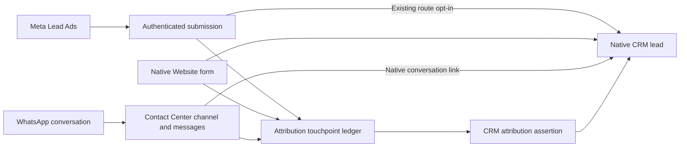

# CRM integrations inside their functional owners

Marketing Center now contains fourteen addons. The CRM and dashboard code belongs to
`marketing_center_base`; the Meta, Contact Center and Website CRM integrations belong to
their respective owners. The five former addon directories and their packaging
directories have been removed.

| Functional owner                    | Responsibility included in this release                                                                           |
| ----------------------------------- | ----------------------------------------------------------------------------------------------------------------- |
| `marketing_center_base`             | Native CRM dependency, attribution ledger, CRM assertions, business events, native UTM application and dashboards |
| `marketing_center_meta`             | Meta connector, Lead Ads submissions and the existing opt-in projection to CRM                                    |
| `marketing_center_contact_center`   | Conversation acquisition, lifecycle and convergence with native conversation-to-lead links                        |
| `marketing_center_website`          | Website acquisition, consent, native form capture, durable CRM intents, recovery, correlation and IP observations |
| `marketing_center_website_whatsapp` | Existing Website-to-WhatsApp handoff and destination resolution                                                   |

Native `crm`, `contact_center_crm` and `website_crm` remain prerequisites. Content
Center remains in its separate repository. CRM integration code is grouped under each
owner's `models/crm` package; it is no longer a separately installed addon.

## Existing data and conversation tracking

Model names, SQL tables, field names, existing record IDs, opaque capabilities, queue
method names, identity keys and serialized arguments remain unchanged. Historical XML
IDs continue to resolve to their original targets. Known legacy Python imports resolve
to the actual loaded owner modules through virtual aliases; these aliases do not provide
an installable addon.

Conversations and their messages continue to belong to Contact Center channels. Native
conversation links associate channels with CRM leads. Attribution touchpoints and
business events retain their existing independent ledgers and CRM assertions. This
release does not change capture settings, create a new WhatsApp lead policy, copy
conversations into CRM chatter or re-enrol historical submissions. Existing Meta route
opt-in and native Website form behavior remain in effect.

## Mandatory two-step existing-database transition

The verified predecessor has Base `16.0.2.0.0`, Meta `16.0.1.1.5`, Contact Center
`16.0.1.3.0`, Website `16.0.1.6.0`, WhatsApp `16.0.1.2.0`, and all five historical
addons installed. Their retained versions are CRM/Dashboard `16.0.2.0.0`, Meta CRM
`16.0.1.1.1`, Contact Center CRM `16.0.1.0.2` and Website CRM `16.0.1.6.2`. Older
lineages and existing owners without those bridges must use the compatible predecessor
release first. Fresh installations of functional owners are supported.

Keep services stopped throughout preparation, source promotion and verification:

1. Use the predecessor registry and the standalone `integration_migration.py` helper
   from the candidate source. `prepare(env)` validates the complete known metadata
   catalog before changing it. It creates canonical aliases, freezes old aliases,
   transfers constraint/relation ownership and repoints the recorded active dependency.
   It returns an uncommitted metadata receipt. The caller must persist and fsync that
   receipt before acknowledging and committing preparation.
2. Promote the exact coordinated source, then run the scoped native upgrade of Base,
   Meta, Contact Center, Website and Website WhatsApp. Native Odoo expands this to
   installed dependents and executes its internal module-list reconciliation. Freeze and
   verify that complete closure before the operation.

Preparation writes the five historical module rows to `uninstallable`; it retains their
IDs, names, versions and aliases. An existing obsolete Suite row is also made
`uninstallable`, retaining its history. Do not invoke native uninstall on these legacy
addons: its copied-view cleanup would delete existing Website views.

Base and owner pre-migrations reject an unprepared graph. Owner post-migrations write
transactional checkpoints before native data commits. Upgrades do not call fresh-install
bootstrap hooks or replay the old Meta history-policy migration.

`inverse(env, receipt)` is allowed only while every checkpoint is absent, no module has
transient flags and the exact prepared metadata projection still matches. The deployment
coordinator must additionally verify the recorded business projection. It restores
original retired-module states and metadata; it never resets pending upgrade flags.
Metadata audit timestamps reflect legitimate ORM ownership operations and are not
falsified during reversal.

Native exceptions can clear transient flags automatically; process termination can leave
them pending. Neither flag state alone proves recovery safety. Any prepared state
without a complete verified success or the complete inverse guards must keep services
stopped with the new source and explicit repair evidence. Do not restart an unknown
partial registry.

The final loader steps after the last module's data commit are deliberately outside the
automatic retry whitelist. If finalisation, constraint checks, custom-view validation or
cleanup fails with all five checkpoints present but the last stored version still old,
keep the new source and service stopped. Do not run preparation again, undo ownership or
clear flags. A separately reviewed repair must run a further native scoped upgrade of
the same five owners under both deployment locks, then repeat the complete original
preservation comparison and service health checks. The original operation's durable
receipt and SQL outcome remain authoritative.

Actual uninstall of a functional owner cleans its retired namespace aliases before
native owner removal. Test that lifecycle only on a disposable database.

## Future removal of co-owned records

The frozen historical XML IDs permanently co-own their targets. Native upgrades keep a
target alive while any legacy alias still references it, even when a later release drops
the canonical XML ID from its source. Before removing a view, field, rule, cron or queue
function, provide an owner pre-migration that validates the canonical target and deletes
only its matching historical aliases by ORM. Then native owner cleanup can remove the
obsolete record. Never remove an entire old namespace as part of a normal upgrade.
Keeping aliases for a removed field or its inherited view can break form rendering;
validate this removal on a migrated clone.

The actual-owner uninstall guard deliberately requires the canonical counterpart of
every remaining legacy alias. Missing canonical rows need an explicit reviewed cleanup
migration; do not bypass that guard or call native uninstall on old modules.
