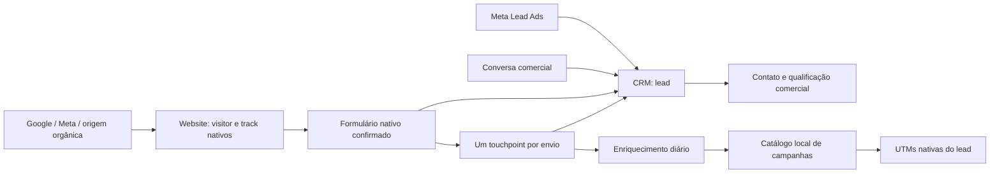

# Marketing Center — consolidação de aquisição (19/09/2026)

## Decisão implementada

O CRM nativo continua sendo o cadastro comercial. Meta Lead Ads, formulários do Website
e conversas comerciais usam os vínculos existentes com `crm.lead`. Mensagens e
atendimento permanecem no Contact Center.

### Website

- Binding com `capture_mode=native` por padrão. O modo `legacy` fica disponível para
  reversão controlada; o histórico existente não é reescrito.
- O lead nasce pelo controller nativo, com a vinculação nativa ao visitante.
- Uma fotografia da aquisição é escolhida no envio: parâmetros da página ou última
  visita elegível anterior dentro de 24 horas. Não combina campanha de uma visita com
  clique de outra. Consultas históricas usam no máximo 200 tracks.
- UTMs, `gad_campaignid`, `gad_source`, GCLID/GBRAID/WBRAID/FBCLID são preservados; URL
  persistida sem query arbitrária. Os campos nativos de UTM são reutilizados. Um
  snapshot novo também limpa defaults de cookies antigos que não pertencem àquela
  aquisição; campos explicitamente enviados no formulário são preservados.
- `occurred_at` é a data do formulário; `acquisition_at` é a data comprovada da visita.
  Uma data de clique desconhecida não é inventada para consultar o Google.
- Token UUID por submissão deduplica reenvios, inclusive após falha de captura. Sem
  JavaScript/token, o formulário funciona, mas reenvios HTTP independentes não têm
  garantia de deduplicação.
- O caminho nativo dispensa o POST de landing, a sessão paralela, intents e
  recibos/exchange de formulário. O sucesso nativo confirma o `generate_lead`.
- Falha de marketing não impede a criação do lead. O cron existente recupera até 50
  capturas pendentes por execução, dentro da janela de recebimento; depois encerra com
  estado e motivo visíveis ao administrador. IDs de clique brutos passam a ser mantidos
  apenas no armazenamento protegido existente após a captura. O snapshot de aquisição é
  mantido para recuperação, sem pesquisar novamente visitas mais recentes.
- A política `informational_notice` vigente permite captura técnica sem depender do
  botão do aviso. `individual_consent` mantém sua exigência de autorização. Isso não é
  declaração de conformidade regulatória nem garantia de coleta total: bloqueadores,
  ausência de URL/visita e limitações do navegador continuam existindo.

### Campanhas e Google

O ID explícito identifica a campanha no catálogo local, usando a conta informada ou uma
única conta Google elegível da empresa. Conta ambígua ou catálogo ainda incompleto
permanecem pendentes; não há adivinhação pelo nome nem lookup por clique para substituir
um ID conhecido. O catálogo já possui sincronização diária.

O cron diário de cliques considera somente touchpoints com vínculo CRM efetivo, sem
campanha já identificada. Revalida vínculo, configuração e retenção ao executar jobs
existentes. Usa a data de aquisição para consultar o GCLID; formulário sem data de
clique comprovada não dispara consulta por uma data presumida.

### Eventos e interface

`res.company.marketing_business_events_enabled` é falso por padrão. Nesse estado, não há
eventos automáticos de CRM, pedidos, faturas, pagamentos ou episódios de atendimento,
nem reconstrução histórica. As guardas precedem locks e filas de marketing; mensagens,
CRM, vendas e contabilidade continuam nativos. Touchpoints úteis e histórico anterior
permanecem disponíveis.

A navegação principal passa a Leads, Campanhas, Conversas e Integrações. O acesso a
conversas mantém as permissões existentes do Contact Center. Histórico técnico,
observabilidade e configurações ficam em Integrações. A suite deixa de exigir o módulo
financeiro `marketing_center_sale_account`.

## Limites e próxima etapa

A correlação por visitante tem limitações em múltiplas abas e dispositivos; não é uma
identidade universal. Não foi criado cálculo de receita/atribuição nem exportação de
leads qualificados para Google/Meta. Essa segunda etapa depende de definir o evento
comercial e seu contrato de envio. Os módulos legados não foram desinstalados; primeiro
se interrompe sua geração, preservando uma reversão simples.

## Validação e implantação

Testes usam PostgreSQL próprio com dados sintéticos, cron/runner desligados e nenhuma
credencial de provedores. O runner reproduzível está em
`tools/local_simplification_tests.py`; evidências locais em
`scans/raw/20260919-marketing-simplification-lab` do repositório operacional. A lista
final de resultados e SHAs acompanha o registro da entrega.

A implantação exige upgrade dos módulos alterados e decisão do operador sobre backup
conforme `odoo16/AGENTS.md`. Não executar backfills históricos, não excluir registros
antigos e não alterar documentos fiscais. Antes de reativar eventos, avaliar a lacuna
histórica para não apresentar relatórios de receita incompletos. Reversão funcional:
restaurar modo `legacy` no binding e a política de eventos apenas se isso for
explicitamente desejado; reversão de código usa o commit anterior e o procedimento de
release.
