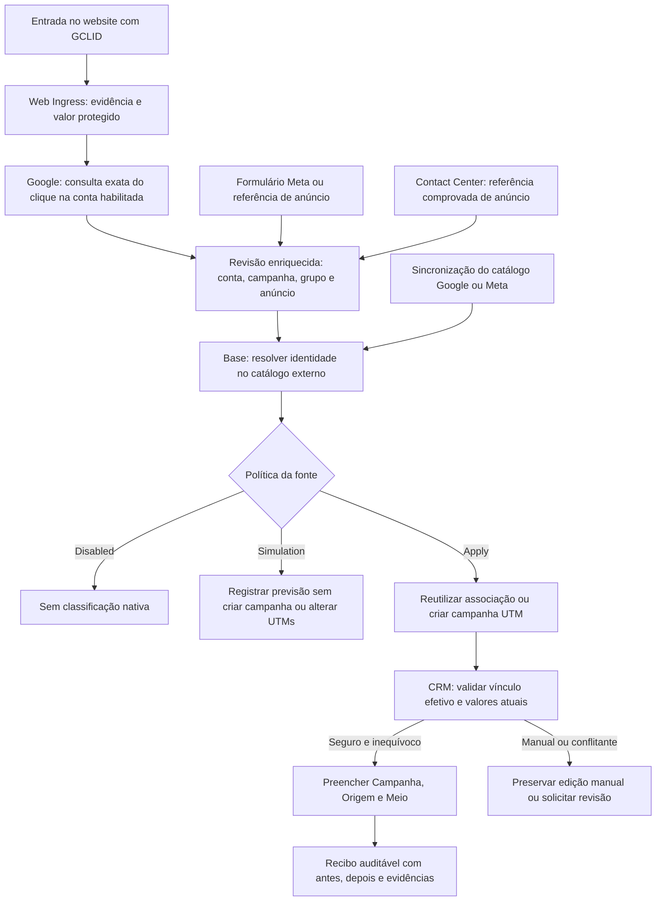

# Campanhas externas e atribuição nativa no CRM

Este guia descreve a classificação de aquisição disponível no código. Instalar
ou atualizar os módulos não ativa a classificação: cada fonte começa em
**Disabled**. A configuração e a ativação de cada ambiente são decisões locais.

## Resultado esperado

Quando existe evidência de uma campanha externa, o Marketing Center resolve sua
identidade e preenche os campos **Campanha**, **Origem** e **Meio** do CRM usando
os modelos nativos `utm.campaign`, `utm.source` e `utm.medium`.

Se a campanha externa já está no catálogo e ainda não tem associação nativa,
a rotina pode criar a `utm.campaign` automaticamente. A campanha continua sendo
administrada no Google ou na Meta; esta operação cria somente o registro de
relatório no Odoo. Não cria anúncio, não altera orçamento e não envia conversão.

O ingresso comercial continua independente: Website CRM e Meta CRM determinam
se a entrada vira Lead ou Oportunidade, conforme sua configuração. A atribuição
não muda tipo, vendedor, equipe, estágio ou probabilidade. Também não cria um
lead para uma submissão histórica que não tenha sido projetada pelo ingresso.

## Responsabilidade dos módulos

| Módulo | Responsabilidade nesta etapa |
|---|---|
| `google_api_base` | Transporte Google, credenciais, limites e erros normalizados. |
| `meta_api_base`, `meta_webhook_base` | Transporte e recebimento Meta; não classificam CRM. |
| `marketing_center_web_ingress` | Registrar a observação web e guardar o identificador de clique protegido, com retenção e política de captura. |
| `marketing_center_website` | Captura no site, política de rastreamento, sessão e ações. |
| `marketing_center_google` | Consultar GCLID exato, enriquecer evidência e resolver referências Google no catálogo. |
| `marketing_center_meta` | Submissões e referências Meta, catálogo e resolução de suas identidades. |
| `marketing_center_base` | Evidência canônica, catálogo, associação entre campanha externa e UTM nativa e política por fonte. |
| `marketing_center_crm` | Escritor único dos três campos nativos, fila de reconciliação, preservação manual e recibos. |
| `marketing_center_website_crm` | Vincular evidência ao lead nativo e comprovar, no momento da inserção, quando “Website” foi somente o valor padrão. |
| `marketing_center_meta_crm` | Criar/vincular o registro comercial conforme a rota; a classificação usa a mesma ponte CRM. |
| `marketing_center_contact_center_crm` | Vincular a evidência da conversa ao CRM; sinais genéricos sem campanha identificada permanecem insuficientes. |

## Configuração por fonte

Como administrador do Marketing Center, abra a fonte Google Ads ou Meta Ads:

1. Mantenha a fonte ativa e seu catálogo sincronizado.
2. Escolha **Native UTM Source** e **Native UTM Medium**. Exemplos locais seriam
   `Google / cpc` ou `Meta / paid_social`; a instalação escolhe seus próprios
   registros. Nenhum desses nomes é imposto pelo módulo.
3. Comece com **Native UTM Mode = Simulation**.
4. Mantenha **Create Missing Native Campaigns** marcado para permitir o cadastro
   automático quando mudar para **Apply**. Desmarcado, a rotina exige associação
   previamente cadastrada.
5. Inspecione a aba **Acquisition** do lead. **Preview classification** apenas
   calcula a previsão; **Reconcile classification** agenda a avaliação. Em
   Simulation, o trabalhador registra a previsão sem escrever nos três campos.
6. Após revisar o resultado, selecione **Apply** na fonte. Alterações de política
   ou associação agendam a reconciliação dos leads vinculados àquele escopo.

O administrador também pode escolher uma `utm.campaign` existente no registro da
campanha externa. Várias campanhas externas podem compartilhar explicitamente a
mesma campanha nativa. Limpar uma associação manual marca o bloqueio de
classificação para evitar recriação imediata; revise o bloqueio ao reativá-la.

### Identidade e nomes

A associação usa o registro externo delimitado por empresa, fonte e identidade
do provedor. Campanhas homônimas de contas diferentes não são unificadas.
O título nativo recebe o nome externo inicial; o identificador técnico inclui
o UUID estável da entidade. Renomear a campanha fora do Odoo não troca a associação
nem sobrescreve um título nativo editado. Reprocessamentos e concorrência não
devem criar uma segunda campanha para a mesma entidade.

### Consulta Google

Na fonte Google Ads, habilite **Resolve captured Google clicks** somente depois
de validar o perfil leitor e a conta. A consulta tem opt-in separado da escrita
de UTMs: pode ser habilitada enquanto a classificação permanece em Simulation.

* Somente GCLID é consultado nesta versão. GBRAID e WBRAID capturados não são
  convertidos em GCLID nem usados para adivinhar a campanha.
* Deve haver exatamente uma fonte Google elegível na empresa. Mais de uma
  produz estado **Ambiguous account**, sem tentativa arbitrária em várias contas.
* A consulta `click_view` filtra o GCLID exato e um único dia no fuso da conta,
  dentro da janela de 90 dias. Confere conta, data, fuso e identificador na resposta.
* Não encontrar resultado deixa a origem desconhecida. Há quatro novas tentativas
  após 15 minutos, 1 hora, 6 horas e 24 horas. Não é prova de tráfego orgânico.
* Perfil, fonte, configuração, retenção e política de captura são revalidados no
  trabalhador. A fila guarda referências, nunca o GCLID bruto. Erros persistidos
  não incluem a consulta ou a resposta bruta do provedor.
* O resultado adiciona uma revisão de enriquecimento à ocorrência canônica.
  A observação original e suas UTMs capturadas permanecem no histórico.
* Se a entidade externa ainda não está no catálogo, a resolução aguarda a
  sincronização existente. A chegada posterior do catálogo reconcilia os vínculos
  e permite criar a campanha nativa, sem refazer o envio do formulário.

Novas evidências elegíveis são agendadas após habilitação. Para registros
históricos, o serviço de reconciliação exige uma lista explícita de até 200
touchpoints; não há varredura automática de todo o histórico. Uma consulta já
encontrada não é repetida. Consultas bloqueadas ou sem resultado podem ser
reavaliadas pelo botão **Retry** do registro de consulta, ainda sujeitas à retenção.

A palavra-chave retornada é a palavra-chave do anúncio, quando disponível;
não é necessariamente o texto pesquisado pelo visitante. Referrer Google sozinho
não distingue orgânico de pago. A identificação de campanha exige evidência.

Referência técnica: [Google Ads ClickView](https://developers.google.com/google-ads/api/reference/rpc/v25/ClickView).

## Escrita, ambiguidades e reversão no CRM

O trabalhador usa exclusivamente vínculos efetivos e revisões aceitas. Múltiplos
touchpoints podem confirmar a mesma combinação de campanha, origem e meio.
Combinações diferentes ficam em revisão; não há escolha automática por nome,
primeiro clique ou último clique nesta etapa.

O preenchimento é permitido quando os campos estão vazios, quando há comprovação
do padrão Website ou quando ainda contêm exatamente os valores da última
aplicação automática. Valores nativos preexistentes e diferentes são preservados.
Qualquer edição explícita desses campos após a criação marca a classificação
como manual, inclusive se o usuário salvar o mesmo valor.

“Website” em um registro antigo, sozinho, não comprova um valor padrão: ele pode
ter sido escolhido intencionalmente. Essa comprovação somente é registrada na
inserção do formulário, com captura permitida e sem UTMs explícitas ou cookies UTM.
Registros antigos com esse meio podem exigir revisão individual.

Se a evidência desaparece ou passa a ser conflitante, a rotina restaura o estado
anterior à primeira aplicação somente enquanto ainda detém os valores. Uma edição
manual sempre prevalece. **Undo automatic classification** também restaura esse
estado e marca a classificação como manual, evitando reaplicação no próximo job.
Desabilitar a fonte pausa a classificação; não limpa em lote as UTMs já aplicadas.

Os recibos são imutáveis, delimitados pela empresa e pela visibilidade do lead.
Guardar uma previsão ou recibo não significa alterar a evidência original.

## Contrato técnico

| Modelo | Campos/serviço principais |
|---|---|
| `marketing.center.source` | `native_utm_mode`, `native_utm_source_id`, `native_utm_medium_id`, `native_utm_auto_create_campaign`, `google_click_lookup_enabled` |
| `marketing.center.external.entity` | `native_utm_campaign_id`, `native_utm_blocked`, `native_utm_mapping_origin`, `native_utm_mapped_at`, `native_utm_mapped_by_id` |
| `marketing.native.utm.service` | `_resolve_touchpoint(..., apply=False)` e `_resolve_entity(..., apply=False)`: simulação por padrão. |
| `marketing.center.google.click.lookup` | Estado, motivo, tentativas, fonte, execução, data/fuso e referência à revisão enriquecida. |
| `marketing.center.google.click.service` | `_reconcile_touchpoints(ids)` para reprocessamento histórico explícito; `_execute` é chamado pela fila. |
| `crm.lead` | `marketing_utm_state`, `marketing_utm_reason`, `marketing_utm_manual`, `marketing_utm_receipt_id`; metadados de padrão e baseline são internos. |
| `marketing.crm.native.utm.service` | `_classify(lead, apply=False)`, chamado de forma assíncrona com `apply=True`. |
| `marketing.crm.utm.application` | `before_json`, `after_json`, `evidence_json`, estado, motivo e assinatura para evitar recibos repetidos. |

Os métodos com `_` são internos, não endpoints RPC. Metadados de procedência e
recibos não são graváveis por RPC, nem por um booleano forjado no contexto.
Jobs utilizam identidades estáveis, lotes delimitados por empresa e locks que
fazem transações concorrentes repetir com um snapshot atualizado.

## Atualização e diagnóstico

Atualize `marketing_center_base`, `marketing_center_crm`,
`marketing_center_google`, `marketing_center_web_ingress` e
`marketing_center_website_crm`, respeitando dependências instaladas. A ponte CRM
passa a depender de `queue_job`. Configure o runner OCA conforme o ambiente;
sem ele, reconciliações permanecem pendentes.

Para um lead sem Campanha:

1. Confirme a existência do vínculo efetivo de aquisição.
2. Confira se há referência externa de campanha/anúncio ou consulta GCLID encontrada.
3. Confira a resolução no catálogo da conta e empresa corretas.
4. Confira modo, origem, meio e bloqueio da fonte/campanha.
5. Confira se a fila processou a reconciliação e leia o último recibo.
6. Se o motivo indicar valores nativos preservados, revise o registro sem apagar
   a procedência manual para forçar uma atribuição.

UTMs textuais vazias no touchpoint podem coexistir com campanha nativa preenchida:
elas descrevem o que foi capturado no evento; a classificação nativa descreve a
associação posteriormente confirmada pelo sistema.
