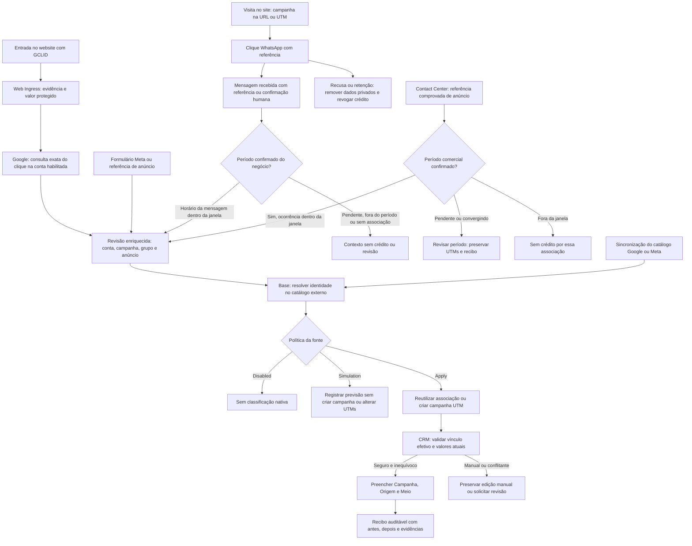

# Campanhas externas e atribuição nativa no CRM

As integrações CRM fazem parte dos módulos proprietários desde a fusão de 06/10/2026.
Para atualizar uma base com os cinco módulos antigos instalados, aplicar primeiro a
[migração de propriedade](crm-integration-fusion.md); não executar diretamente `-u`
sobre o código novo antes dessa preparação.

Este guia descreve a classificação de aquisição disponível no código. Instalar ou
atualizar os módulos não ativa a classificação: cada fonte começa em **Disabled**. A
configuração e a ativação de cada ambiente são decisões locais.

## Resultado esperado

Quando existe evidência de uma campanha externa, o Marketing Center resolve sua
identidade e preenche os campos **Campanha**, **Origem** e **Meio** do CRM usando os
modelos nativos `utm.campaign`, `utm.source` e `utm.medium`.

Se a campanha externa já está no catálogo e ainda não tem associação nativa, a rotina
pode criar a `utm.campaign` automaticamente. A campanha continua sendo administrada no
Google ou na Meta; esta operação cria somente o registro de relatório no Odoo. Não cria
anúncio, não altera orçamento e não envia conversão.

```mermaid
flowchart TD
    W[Entrada no website com GCLID] --> V[Web Ingress: evidência e valor protegido]
    V --> G[Google: consulta exata do clique na conta habilitada]
    G --> E[Revisão enriquecida: conta, campanha, grupo e anúncio]
    M[Formulário Meta ou referência de anúncio] --> E
    W2[Visita no site: campanha na URL ou UTM] --> K[Clique WhatsApp com referência]
    K --> Msg[Mensagem recebida com referência ou confirmação humana]
    Msg --> B2{Período confirmado do negócio?}
    B2 -->|Horário da mensagem dentro da janela| E
    B2 -->|Pendente, fora do período ou sem associação| Ctx[Contexto sem crédito ou revisão]
    K --> Priv[Recusa ou retenção: remover dados privados e revogar crédito]
    C[Contact Center: referência comprovada de anúncio] --> B{Período comercial confirmado?}
    B -->|Sim, ocorrência dentro da janela| E
    B -->|Pendente ou convergindo| Hold[Revisar período: preservar UTMs e recibo]
    B -->|Fora da janela| Excluded[Sem crédito por essa associação]
    E --> R[Base: resolver identidade no catálogo externo]
    S[Sincronização do catálogo Google ou Meta] --> R
    R --> P{Política da fonte}
    P -->|Disabled| D[Sem classificação nativa]
    P -->|Simulation| T[Registrar previsão sem criar campanha ou alterar UTMs]
    P -->|Apply| U[Reutilizar associação ou criar campanha UTM]
    U --> L[CRM: validar vínculo efetivo e valores atuais]
    L -->|Seguro e inequívoco| A[Preencher Campanha, Origem e Meio]
    L -->|Manual ou conflitante| Q[Preservar edição manual ou solicitar revisão]
    A --> H[Recibo auditável com antes, depois e evidências]
```

O ingresso comercial continua independente: os adaptadores de formulário `website.form`
e Meta determinam se a entrada vira Lead ou Oportunidade, conforme sua configuração. A
atribuição não muda tipo, vendedor, equipe, estágio ou probabilidade. Também não cria um
lead para uma submissão histórica que não tenha sido projetada pelo ingresso. A ponte
`website.whatsapp` acompanha visita, clique, mensagem e negócio existente; não cria lead
automaticamente nesta fase. O horário original da aquisição não é reescrito: a
elegibilidade usa o horário da **mensagem** e o período confirmado, com início inclusivo
e fim exclusivo. Recusa e retenção removem os dados privados e impedem crédito,
preservando referências técnicas de campanha e auditoria conforme o contrato Base.
Associação apenas sugerida, período em revisão e processamento pendente são estados
explícitos, sem promover contexto a crédito.

## Responsabilidade dos módulos

| Módulo                               | Responsabilidade nesta etapa                                                                                                                                |
| ------------------------------------ | ----------------------------------------------------------------------------------------------------------------------------------------------------------- |
| `google_api_base`                    | Transporte Google, credenciais, limites e erros normalizados.                                                                                               |
| `meta_api_base`, `meta_webhook_base` | Transporte e recebimento Meta.                                                                                                                              |
| `marketing_center_website`           | Ingresso web incorporado, observação e identificador protegido; captura, sessão, ações e vínculo da submissão nativa ao lead, incluindo UTMs padrão.        |
| `marketing_center_website_whatsapp`  | Captura congelada de aquisição e clique, associação com a mensagem, ocorrência canônica, vínculo ao negócio por período da mensagem, Jornada e privacidade. |
| `marketing_center_google`            | Consulta GCLID exata, enriquecimento de evidência e resolução das referências Google.                                                                       |
| `marketing_center_meta`              | Submissões, referências e catálogo Meta; criação ou vínculo comercial conforme a rota.                                                                      |
| `marketing_center_base`              | Evidência canônica, catálogo externo, política por fonte e escritor único das UTMs nativas, com reconciliação, preservação manual e recibos.                |
| `marketing_center_contact_center`    | Vínculo entre evidência da conversa e CRM dentro do período comercial confirmado; sinais sem campanha identificada permanecem insuficientes.                |

`marketing_center_web_ingress` foi incorporado ao Website; não é addon atual.

## Configuração por fonte

Como administrador do Marketing Center, abra a fonte Google Ads ou Meta Ads:

1. Mantenha a fonte ativa e seu catálogo sincronizado.
2. Escolha **Native UTM Source** e **Native UTM Medium**. Exemplos locais seriam
   `Google / cpc` ou `Meta / paid_social`; a instalação escolhe seus próprios registros.
   Nenhum desses nomes é imposto pelo módulo.
3. Comece com **Native UTM Mode = Simulation**.
4. Mantenha **Create Missing Native Campaigns** marcado para permitir o cadastro
   automático quando mudar para **Apply**. Desmarcado, a rotina exige associação
   previamente cadastrada.
5. Inspecione a aba **Acquisition** do lead. **Preview classification** apenas calcula a
   previsão; **Reconcile classification** agenda a avaliação. Em Simulation, o
   trabalhador registra a previsão sem escrever nos três campos.
6. Após revisar o resultado, selecione **Apply** na fonte. Alterações de política ou
   associação agendam a reconciliação dos leads vinculados àquele escopo.

O administrador também pode escolher uma `utm.campaign` existente no registro da
campanha externa. Várias campanhas externas podem compartilhar explicitamente a mesma
campanha nativa. Limpar uma associação manual marca o bloqueio de classificação para
evitar recriação imediata; revise o bloqueio ao reativá-la.

### Identidade e nomes

A associação usa o registro externo delimitado por empresa, fonte e identidade do
provedor. Campanhas homônimas de contas diferentes não são unificadas. O título nativo
recebe o nome externo inicial; o identificador técnico inclui o UUID estável da
entidade. Renomear a campanha fora do Odoo não troca a associação nem sobrescreve um
título nativo editado. Reprocessamentos e concorrência não devem criar uma segunda
campanha para a mesma entidade.

### Consulta Google

Na fonte Google Ads, habilite **Resolve captured Google clicks** somente depois de
validar o perfil leitor e a conta. A consulta tem opt-in separado da escrita de UTMs:
pode ser habilitada enquanto a classificação permanece em Simulation.

- Somente GCLID é consultado nesta versão. GBRAID e WBRAID capturados não são
  convertidos em GCLID nem usados para adivinhar a campanha.
- Deve haver exatamente uma fonte Google elegível na empresa. Mais de uma produz estado
  **Ambiguous account**, sem tentativa arbitrária em várias contas.
- A consulta `click_view` filtra o GCLID exato e um único dia no fuso da conta, dentro
  da janela de 90 dias. Confere conta, data, fuso e identificador na resposta.
- Não encontrar resultado deixa a origem desconhecida. Há quatro novas tentativas após
  15 minutos, 1 hora, 6 horas e 24 horas. Não é prova de tráfego orgânico.
- Perfil, fonte, configuração, retenção e política de captura são revalidados no
  trabalhador. A fila guarda referências, nunca o GCLID bruto. Erros persistidos não
  incluem a consulta ou a resposta bruta do provedor.
- O resultado adiciona uma revisão de enriquecimento à ocorrência canônica. A observação
  original e suas UTMs capturadas permanecem no histórico.
- Se a entidade externa ainda não está no catálogo, a resolução aguarda a sincronização
  existente. A chegada posterior do catálogo reconcilia os vínculos e permite criar a
  campanha nativa, sem refazer o envio do formulário.

Novas evidências elegíveis são agendadas após habilitação. Para registros históricos, o
serviço de reconciliação exige uma lista explícita de até 200 touchpoints; não há
varredura automática de todo o histórico. Uma consulta já encontrada não é repetida.
Consultas bloqueadas ou sem resultado podem ser reavaliadas pelo botão **Retry** do
registro de consulta, ainda sujeitas à retenção.

A palavra-chave retornada é a palavra-chave do anúncio, quando disponível; não é
necessariamente o texto pesquisado pelo visitante. Referrer Google sozinho não distingue
orgânico de pago. A identificação de campanha exige evidência.

Referência técnica:
[Google Ads ClickView](https://developers.google.com/google-ads/api/reference/rpc/v25/ClickView).

## Escrita, ambiguidades e reversão no CRM

O trabalhador usa a partição elegível dos vínculos efetivos e revisões aceitas. Para
Contact Center, a associação deve ter período confirmado, com início inclusivo e fim
exclusivo, e a ocorrência efetiva precisa estar dentro da janela. Outras autoridades,
como `website.form` e Meta, conservam sua elegibilidade independente. A autoridade
`website.whatsapp` usa a mensagem recebida para testar a janela confirmada; a data de
aquisição permanece a original, mesmo quando anterior ao negócio. Múltiplos touchpoints
podem confirmar a mesma combinação de campanha, origem e meio. Combinações diferentes
ficam em revisão; não há escolha automática por nome, primeiro clique ou último clique
nesta etapa.

O preenchimento é permitido quando os campos estão vazios, quando há comprovação do
padrão Website ou quando ainda contêm exatamente os valores da última aplicação
automática. Valores nativos preexistentes e diferentes são preservados. Qualquer edição
explícita desses campos após a criação marca a classificação como manual, inclusive se o
usuário salvar o mesmo valor.

“Website” em um registro antigo, sozinho, não comprova um valor padrão: ele pode ter
sido escolhido intencionalmente. Essa comprovação somente é registrada na inserção do
formulário, com captura permitida e sem UTMs explícitas ou cookies UTM. Registros
antigos com esse meio podem exigir revisão individual.

O estado **Período comercial precisa de revisão** (`scope_review`) pausa a
classificação, preservando os três campos UTM e o último recibo aplicado. Ele abrange
associações legadas ou em revisão, suporte pendente de contexto, convergência ainda
incompleta e origem órfã após exclusão de conversa. Não restaura o baseline nesse
estado. Uma pendência desse tipo pode pausar o negócio inteiro, mesmo com outra origem
elegível.

Para resolver, o agente autorizado confirma ou revisa o período pela **Jornada** do lead
e aguarda a convergência. Se a conversa foi excluída, o administrador Marketing faz uma
decisão explícita nos campos UTM ou usa **Undo automatic classification**, quando as
pré-condições da reversão permitem. Esses dois caminhos administrativos marcam a
classificação como manual; a Jornada deixa de solicitar a decisão sobre uma origem órfã
já resolvida. Uma associação ainda em revisão, uma origem pendente ligada a uma conversa
existente ou uma convergência em andamento continuam sinalizadas: decidir a UTM
manualmente não confirma o período nem concede crédito a essas origens. As origens ainda
inelegíveis continuam sem crédito, e a evidência órfã é preservada.

Fora da pausa de revisão, evidência efetivamente revogada, ausente ou conflitante pode
restaurar o estado anterior à primeira aplicação somente enquanto a rotina ainda detém
os valores. Uma edição manual sempre prevalece. **Undo automatic classification** também
restaura esse estado e evita reaplicação no próximo job. Desabilitar a fonte pausa a
classificação; não limpa em lote as UTMs já aplicadas.

O status da campanha na plataforma não invalida a atribuição: arquivar, remover ou
excluir uma campanha no Gerenciador da Meta ou no Google Ads não desfaz a origem dos
leads já classificados, e um touchpoint novo de uma campanha arquivada que existe no
catálogo continua sendo classificado. Continuam recusando a classificação: fonte
desativada, campanha bloqueada (`native_utm_blocked`), ausência no catálogo/tombstone,
conflito e as regras de privacidade. Uma mudança real no catálogo (nova revisão,
tombstone ou correção de pai) agenda a reconciliação da entidade e de seus descendentes;
uma observação repetida sem mudança não agenda nada.

Os recibos são imutáveis, delimitados pela empresa e pela visibilidade do lead. Guardar
uma previsão ou recibo não significa alterar a evidência original.

## Contrato técnico

| Modelo                                  | Campos/serviço principais                                                                                                                       |
| --------------------------------------- | ----------------------------------------------------------------------------------------------------------------------------------------------- |
| `marketing.center.source`               | `native_utm_mode`, `native_utm_source_id`, `native_utm_medium_id`, `native_utm_auto_create_campaign`, `google_click_lookup_enabled`             |
| `marketing.center.external.entity`      | `native_utm_campaign_id`, `native_utm_blocked`, `native_utm_mapping_origin`, `native_utm_mapped_at`, `native_utm_mapped_by_id`                  |
| `marketing.native.utm.service`          | `_resolve_touchpoint(..., apply=False)` e `_resolve_entity(..., apply=False)`: simulação por padrão.                                            |
| `marketing.center.google.click.lookup`  | Estado, motivo, tentativas, fonte, execução, data/fuso e referência à revisão enriquecida.                                                      |
| `marketing.center.google.click.service` | `_reconcile_touchpoints(ids)` para reprocessamento histórico explícito; `_execute` é chamado pela fila.                                         |
| `crm.lead`                              | `marketing_utm_state`, `marketing_utm_reason`, `marketing_utm_manual`, `marketing_utm_receipt_id`; metadados de padrão e baseline são internos. |
| `marketing.crm.native.utm.service`      | `_classify(lead, apply=False)`, chamado de forma assíncrona com `apply=True`.                                                                   |
| `marketing.crm.utm.application`         | `before_json`, `after_json`, `evidence_json`, estado, motivo e assinatura para evitar recibos repetidos.                                        |

Os métodos com `_` são internos, não endpoints RPC. Metadados de procedência e recibos
não são graváveis por RPC, nem por um booleano forjado no contexto. Jobs utilizam lotes
delimitados por empresa e locks que fazem transações concorrentes repetir com um
snapshot atualizado. As identidades dos jobs de reconciliação (escopo e lead) incluem a
transação que os agendou: chamadas da mesma transação são agrupadas, e cada transação
posterior ganha seu próprio despertar, mesmo que um job anterior de mesmo escopo termine
enquanto ela ainda enxerga o snapshot antigo.

## Atualização e diagnóstico

Publique conjuntamente os dois repositórios com a nova API de período. Atualize Contact
CRM/Kanban/Sales e Marketing Base/Contact/Google/Website-WhatsApp/Automation instalados;
preserve as demais dependências e providers. O Website contém o antigo ingresso web.
Respeite a preparação de propriedade caso a base ainda esteja na estrutura anterior. O
serviço CRM do Base usa `queue_job`; sem runner, a convergência e a reconciliação
permanecem pendentes. Testes locais não autorizam implantação.

Para um lead sem Campanha:

1. Confirme a existência do vínculo efetivo de aquisição. Para Contact Center, confira o
   período na Jornada, a ocorrência dentro da janela e a conclusão da convergência.
   `scope_review` conserva a campanha anterior até resolver a pendência; não significa
   ausência de evidência.
2. Confira se há referência externa de campanha/anúncio ou consulta GCLID encontrada.
3. Confira a resolução no catálogo da conta e empresa corretas.
4. Confira modo, origem, meio e bloqueio da fonte/campanha.
5. Confira se a fila processou a reconciliação e leia o último recibo.
6. Se o motivo indicar valores nativos preservados, revise o registro sem apagar a
   procedência manual para forçar uma atribuição.

UTMs textuais vazias no touchpoint podem coexistir com campanha nativa preenchida: elas
descrevem o que foi capturado no evento; a classificação nativa descreve a associação
posteriormente confirmada pelo sistema.
